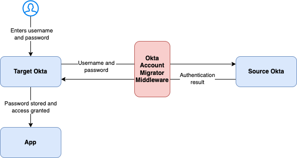

# Okta Account Migrator

## Introduction

Okta Account Migrator is a helper tool to migrate accounts from one Okta instance to another. It reads batches of 
accounts from the source Okta to create them in the target Okta. The size of the batches is configurable. The results are 
- The accounts within the batch being created in the target Okta configured to trigger the Import Password Inline Hook as soon as the users attempt to log in, and
- A CSV file with the properties of the batch of migrated accounts to include in the communication campaign.

The new account at the target Okta is configured to import the password from the source Okta via the 'Import Password Inline Hook'. This requires the target Okta to have been setup with this hook via _Workflows => Inline Hooks => Add Inline Hook => Import Password_. The account status will trigger calling this hook. The hook is configured to call the Okta Account Migrator server with the credentials entered by the user. Okta Account Migrator attempts to authenticate with these credentials at the source Okta. If this succeeds, then the succesful response is sent to the target Okta, which will let the user in and store the password. If authentication at the Okta source fails, the user will not be able to enter the target Okta until authentication at the source succeeds.

After logging in to the target Okta, the user will be required to set up any other required authenticators as the account is newly created and second factors at the source Okta have not been migrated.

## Overview

The below diagram aimes to depict that credentials entered by a newly migrated user are checked against the source Okta. If authentication succeeeds, the password is stored in the target Okta, and the user is granted access. The next time the user logs in, the password will be checked against the target Okta.



## Implementation
Accouns are migrated from source to target in two phases. Initially, the accounts are created at the target Okta instance using their profiles from the source IdP. Secondly, when the user attempts to authenticate at the target, they trigger their password migration. These two stages are explained below.

### Profile migration
Okta Account Migration enables migration operators to migrate batches of account from target to source. By accessing
and authenticating to the web UI, the migration operator can check the configured target and source, define a size
of the migration batch and initiate migration.

This will query the source IdP for the contents of the migration backlog. Since implementation of the source IdP is 
implemented modularly, how the migration backlog is implemented can vary. When using an Okta instance as source IdP, 
the migration backlog is implemented as a group identified with its id. 

The batch is populated with as many accounts from the migration backlog as possibly, given the batch size entered
by the migration operator. Every account is attempted to be created at the target. Processing the batch results in
an excelsheet with details on the batch, the status per account, exceptions and the new user as at the target.

The accounts are created in a way that log-in attempts with the new acount at the target result in the Password Inline Hook to be triggered. Its working is explained in the next paragraph.


### Password migration

By creating accounts with their credentials set to the password hook, logging onto the accounts will trigger
the [Password Import Inline Hook](https://developer.okta.com/docs/reference/password-hook/). This hook needs to be configured at the target Okta instance and point to the url of the Okta Account Migrator deploymnet at the /verify path. The target Okta instance will post the credentials the user just entered to that url. Okta Account Migrator will verify the credentials at the configured source. How this is implemented, depends on the source implementation as this is modular. For the implementation of an Okta instance as source, the API is called.

If verification returns a positive result, this is passed back to the target Okta instance. This is hash and store the entered password to enable the user to log in to Okta using its own verification mechanisms the next time. 

After logging into the target Okta instance, policies may apply causing the user to be required to set up additional authenticators.

## Configuration

### Target IdP configuration

Okta Account Migrators purpose is to migrate accounts from source IdP (including application with built-in authentication to Okta). Therefor, the target IdP is always Okta. To authenticate to Okta Account Migrator, 
the Okta Sign-In Widget is used which integrated to Okta (Classic Engine) using the Authorization Code flow 
with client credentials. This parapgraph documents the configuration of the integration in the Okta target
instance.

- Add an OIDC application using method "OIDC - OpenID Connect" of Application Type "Web Application"
- Give the application a name ("Okta Account Migrator [env]") and select "Authorization Code" for Grant Type
- Set the redirect uri on https://[host]]/login/callback
- Assign the application to the proper group. Note that users Okta Account Migrator need to be able to create users and as a result require an administrator role.
- Save the app definition

- Open the app's details and take the client id and client secret for configuration on the client side

- Add the deployment url (https://[host]]/) to Trusted Origins for type=CORS at Security => API => Trusted Origins

- Add an Access Policy for the default authorization server (if that's the one used) for the client (app) and with appropiate token life times.

### Generic app configuration
Configration is made available to the app using `config.js`. However, as the app is expected to run in a container, actual configuration is set using environment variables in the container. The configuration options are described based on `config.js`.

```
const config = {
    timezone: "Europe/Amsterdam",                               // The timezone is used to have correct 
                                                                // timestamps in logging
    server: {
        port: process.env.SERVER_PORT,                          // The port on which the express webserver will listen
        cert: process.env.SERVER_CERT,                          // The server certificate of the express webserver
        key: process.env.SERVER_KEY                             // The private key with the server certificate
                                                                // TODO: Make HTTPS optional
    },
    source: {
        plugin: "okta",                                         // The base name of the plugin implmenting 
                                                                //configuration and methods for the source IdP. 
                                                                //A file name with this base name and the 'js' 
                                                                // extension is expected to exist in the sources 
                                                                // directory of the app.
    },
    target: {
        baseUrl: process.env.OKTA_TARGET_BASEURL,               // The base url of the Okta target instance
        oidcRedirectUri: process.env.OKTA_OIDC_REDIRECT_URI,    // The redirect URI ending on /login/callback as 
                                                                // configured in the target Okta instance.
        oidcClientId: process.env.OKTA_OIDC_CLIENT_ID,          // The OIDC client ID as provided when configuring
                                                                // the app definition in the target Okta instance.
        oidcClientSecret: process.env.OKTA_OIDC_CLIENT_SECRET,  // The OIDC client secret as provided after 
                                                                // configuring the app definition in the target Okta 
                                                                // instance.
        hookAuthentication: {
            header: "authorization",                            // The target Okta instance sending the hook will 
                                                                // authenticate itself with a secret in this header
            secret: process.env.OKTA_TARGET_SECRET              // The secret with which the Okta target instance will
                                                                // authenticate itself.
        }
    }

}
```

The texts after "process.env" are expected to be set as environment variables on the container.

### Source IdP Configuration

Interaction with the source identity provider is expected to be implemented as a plugin. It is referenced using the
`source.plugin` configuration option. The string configured is expected as the filename `[string].js` in the `sources` directory. A plugin for using an Okta instance as source is delivered with this project and can serve
as a reference implementation.

Source plugins also have configuration. What is configured depends on the implementation, but at least a string for
`baseUrl` is expected to be set.

The Okta source plugin is configured using the following properties:

```
export const config = {
    baseUrl: process.env.OKTA_SOURCE_BASEURL,               // The base url, including api/v1 of the 
                                                            // Okta target instance
    token: process.env.OKTA_SOURCE_TOKEN,                   // The authentication token for the Okta 
                                                            // source  instance
                                                            // TODO: Implement scoped app authorization
    backlogGroupId: process.env.OKTA_SOURCE_BACKLOG_GROUP,  // The Okta group ID that contains the
                                                            // migration backlog
    allowedUserStatusses: ["ACTIVE"],                       // The account statusses that apply for 
                                                            // migration to the target Okta instance.
    allowedAuthStatusses: ["SUCCESS", "MFA_ENROLL"],        // The account statusses returned by Okta
                                                            // after authenticating the user that
                                                            // result in a positive verification result.
}

```

More information on the implementation of source IdP plugins is contained in the next chapter.


## Source IdP Modules

An implementation of a source IdP plugin in javascript is expected to carry a unique name and be available in the `sources` directory. The module should export two objects; `config` and `methods`. 

### `config`
The `config` object is exported since it is included in the generic config object of the app. At least `baseUrl` is currently used by other parts of the app. The `config` object is described in the previous paragraph.

The `methods` object should contain three functions

### `methods.getBacklog(batchSize)`
This function is expectected to return the complete list of users, every one described with the following 
properties:
- `id`; the id of the account in the source
- `status`; the account status
- `firstName`; the first name of the user
- `lastName`; the last name of the user
- `email`; the email address of the user
- `login`; the user name of the user

The size of the returned array should only be limited by the `batchSize` parameter, so pagination may be required.

### `methods.removeFromBacklog(id)`

This function removes a succesfully migrated account from the backlog. It does not return a value.

### `methods.authenticateUser(username, password)`

This functies verifies the provided credentials at the source and returns true for succesful verification or false for failed verification

## Security

This project is designed with security as primary focus. There is as little TLS termination as possible and the project itself implements end-to-end encryption. This means that:
- The user enters their credentials at the target login screen provided by Okta. Obviously, communication between the users client and the Okta server is encrypted using TLS.
- Okta receives the credentials as it always does. Instead of checking the credentials against the Okta Universal Directory, the credentials are sent to Okta Account Migrator. Okta Account Migrator contains an embedded Express webserver configured to terminate TLS. This means that surrounding infrastructure *does not* terminate TLS and will not send credentials unencrypted over the internal network. Credentials are sent from the target Okta instance to Okta Account Migrator end-to-end encrypted.
- Okta Account Migrator sets up a TLS encrypted connection to the API at the source Okta instance and verifies the credentials over this connection. Credentials are never logged and only processed in memory for as long as the verification takes.


## Open issues

_To Do_
- Implement Okta API pagination
- Implement code verification using Node.js SEA or code signing
- Prepare OIDC authentication for Identity Engine with optionally Interaction code flow


## References

- https://developer.okta.com/docs/reference/password-hook/
- https://developer.okta.com/docs/guides/password-import-inline-hook/nodejs/main/
- https://www.okta.com/sites/default/files/2021-02/WPR_Okta-User-Migration-Guide.pdf
